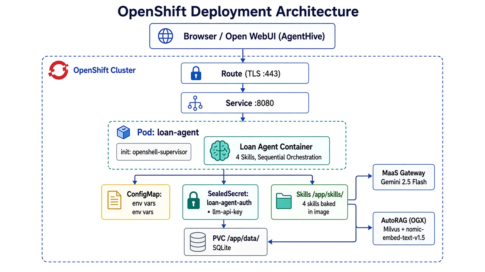
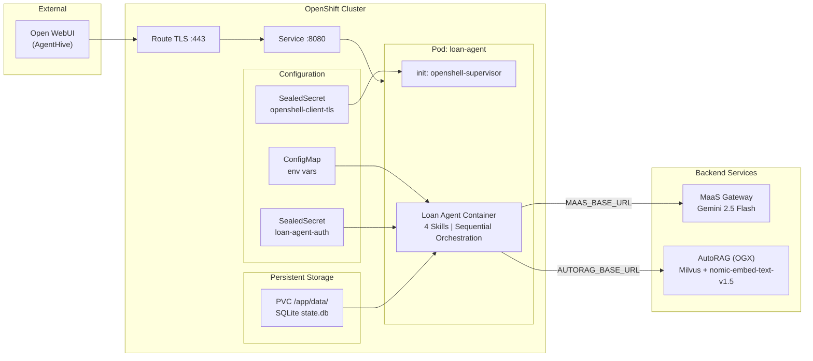
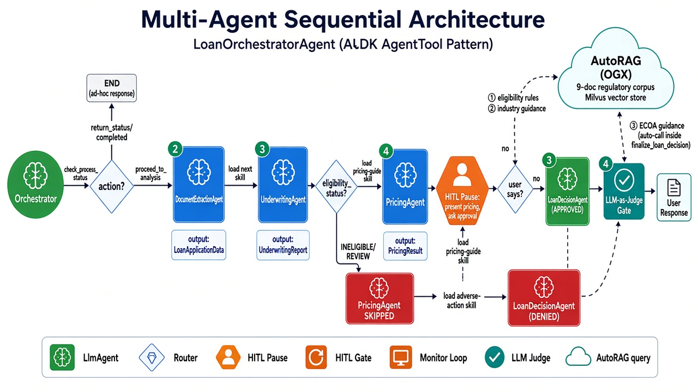
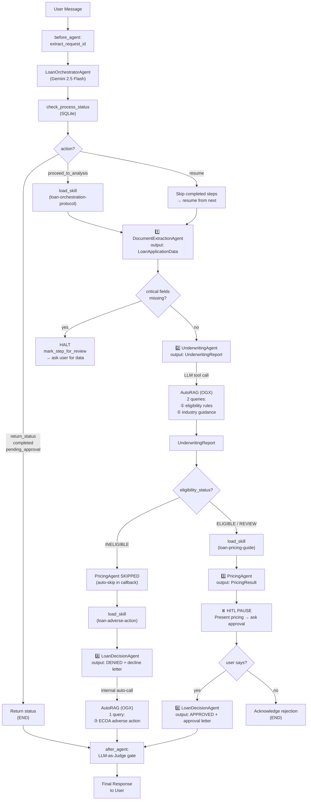
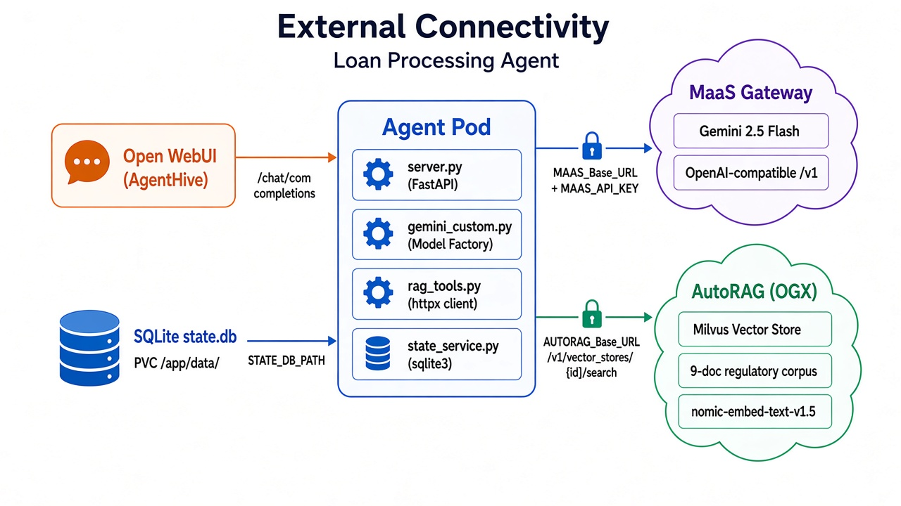
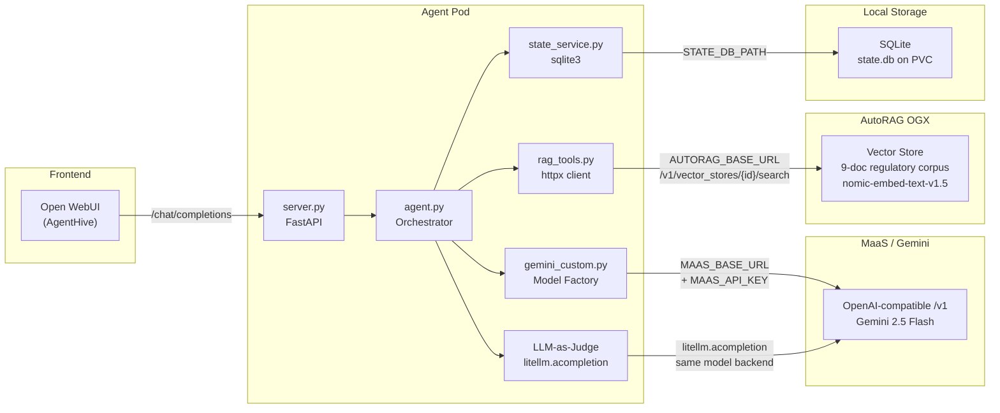
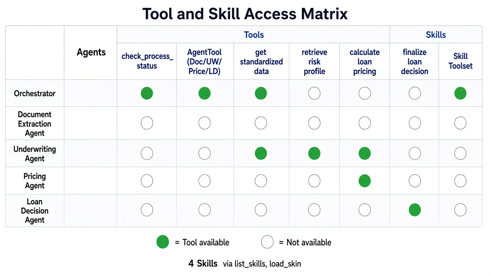
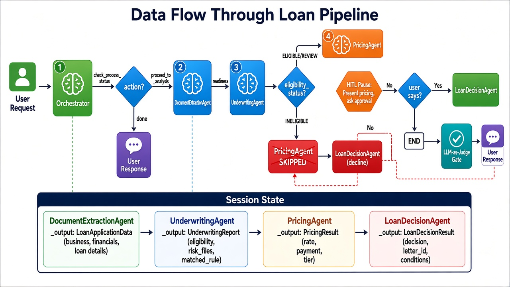
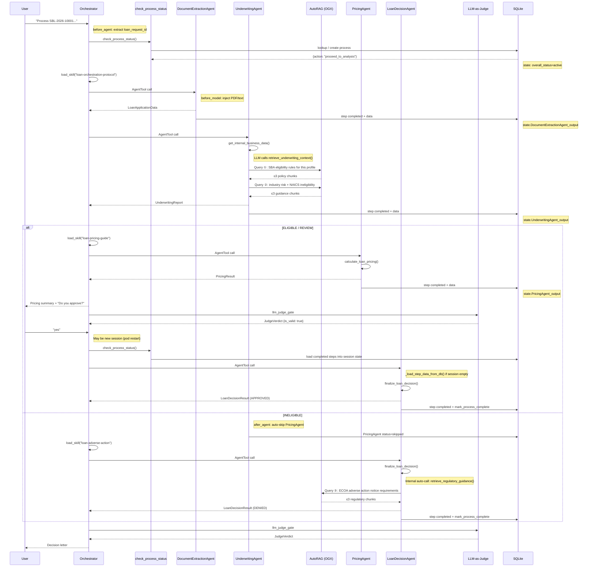

# Architecture

Detailed architecture documentation for the Loan Agent. Every diagram is traced from the actual source code. Each section includes an editable Mermaid diagram.

---

## 1. OpenShift Deployment Architecture

How the agent is deployed on OpenShift as a single pod in the AgentSandbox + OpenShell pattern.



**Source**: [`Containerfile`](../Containerfile), [`server.py`](../server.py), [`README.md § D`](../README.md)

The pod runs a single **agent container** with 4 skills and the full regulatory corpus baked into the image:

| Container | Image | Port | Role |
|---|---|---|---|
| `loan-agent` | `small-business-loan-agent:latest` | 8080 | Loan agent (FastAPI API server) |
| init: `openshell-supervisor-install` | `ghcr.io/nvidia/openshell/supervisor` | -- | OpenShell network supervisor |

**Network path**: Route (TLS edge :443) → Service → Agent Pod

One Route exposes the agent:

| Route | Port | Purpose |
|---|---|---|
| `loan-agent` | 8080 | Agent API (`/chat/completions`, `/v1/chat/completions`, `/health`, `/.well-known/agent-card.json`) |

**Configuration**:

| Resource | Name | Purpose |
|---|---|---|
| ConfigMap | sandbox env vars | Model name, AutoRAG endpoint, bank name, rate tiers |
| SealedSecret | `loan-agent-auth` | MaaS API key (`llm-api-key`) |
| SealedSecret | `openshell-client-tls` | OpenShell gateway TLS (`ca.crt`, `tls.crt`, `tls.key`) |
| PVC | `/app/data/` | SQLite state DB (`state.db`) — survives pod restarts |
| Skills | `/app/skills/` (baked in image) | 4 SKILL.md artifacts for domain knowledge |
| Corpus | `/app/tools/corpus/` (baked in image) | 9 regulatory markdown documents for AutoRAG seeding |

<details>
<summary>Mermaid source (editable)</summary>



</details>

---

## 2. Multi-Agent Sequential Architecture

The agent uses ADK's `AgentTool` pattern for sequential orchestration: 1 orchestrator + 4 sub-agents called as tools, with an implicit HITL pause after pricing.



**Source**: [`small_business_loan_agent/agent.py`](../small_business_loan_agent/agent.py)

| Agent | `output_key` | Model | Tools | RAG Calls | Callbacks |
|---|---|---|---|---|---|
| **LoanOrchestratorAgent** | — | Gemini 2.5 Flash | `SkillToolset`, `check_process_status`, `AgentTool(×4)` | — | `before_agent`: extract request ID · `before_tool`: halt/skip guard · `after_agent`: LLM-as-Judge |
| **DocumentExtractionAgent** | `DocumentExtractionAgent_output` | Gemini 2.5 Flash | — (no tools) | — | `before_agent`: state check · `before_model`: inject document · `after_agent`: state logging |
| **UnderwritingAgent** | `UnderwritingAgent_output` | Gemini 2.5 Flash | `get_internal_business_data`, `retrieve_underwriting_context` | 2 AutoRAG queries (LLM tool call) | `before_agent`: state check + load rules · `after_agent`: state logging + INELIGIBLE skip |
| **PricingAgent** | `PricingAgent_output` | Gemini 2.5 Flash | `calculate_loan_pricing` | — | `before_agent`: state check · `after_agent`: state logging |
| **LoanDecisionAgent** | `LoanDecisionAgent_output` | Gemini 2.5 Flash | `finalize_loan_decision` | 1 AutoRAG query (internal, auto) | `before_agent`: state check · `after_agent`: state logging + mark complete |

### Multi-Point AutoRAG Integration

The agent makes up to **3 targeted AutoRAG queries** per loan run, pulling only the most relevant regulatory text for each application's specific profile. AutoRAG queries are handled at two different levels:

| Query | Function | Agent | Call Type | AutoRAG → OGX |
|---|---|---|---|---|
| SBA eligibility rules | `retrieve_eligibility_rules()` | UnderwritingAgent | **LLM tool call** — the LLM decides to call `retrieve_underwriting_context()` with application facts | `/v1/vector_stores/{id}/search` |
| Industry risk guidance | `retrieve_industry_guidance()` | UnderwritingAgent | **LLM tool call** — same tool, second query | `/v1/vector_stores/{id}/search` |
| ECOA adverse action | `retrieve_regulatory_guidance()` | LoanDecisionAgent | **Internal function call** — called automatically inside `finalize_loan_decision()` on INELIGIBLE path | `/v1/vector_stores/{id}/search` |

**Key distinction**: `retrieve_underwriting_context` is a registered ADK tool — the UnderwritingAgent LLM calls it with extracted application facts (industry, years_in_business, annual_revenue, loan_amount, naics_code). Internally it makes 2 AutoRAG searches. By contrast, `retrieve_regulatory_guidance` is called automatically inside `finalize_loan_decision` — the LoanDecisionAgent LLM never sees it as a tool.

**Graceful degradation**: When AutoRAG is not configured (`AUTORAG_BASE_URL` unset), all retrieval functions return empty strings. UnderwritingAgent falls back to static `eligibility_rules.json` loaded by `before_agent_callback_with_state_check`. LoanDecisionAgent generates decline letters without regulatory text. No code change needed — `config.using_autorag()` gates all queries.

### Safety Features

- **HITL approval pause**: Orchestrator stops after PricingAgent and asks "Do you approve this loan? (yes/no)" — LoanDecisionAgent is only called on explicit "yes"
- **LLM-as-Judge gate**: After-agent callback on the orchestrator validates trajectory correctness, data grounding (no hallucination), and response completeness before showing the response to the user
- **Before-tool halt guard**: `before_tool_callback_check_process_status` blocks tool calls when the process is in `pending_approval`, `failed`, or `completed` state
- **INELIGIBLE auto-skip**: When UnderwritingAgent returns `INELIGIBLE`, PricingAgent is automatically skipped (both in the before-tool callback and after-agent state callback)
- **State prerequisite check**: Each sub-agent's `before_agent_callback_with_state_check` verifies all prior steps are completed before proceeding
- **Missing data detection**: `_check_for_issues()` flags missing critical fields (business_name, owner_name, loan_amount_requested, annual_revenue) and marks the step for human review

### Three Workflow Paths

**Path A — ELIGIBLE/REVIEW (happy path):**
```
check_process_status → load_skill("loan-orchestration-protocol")
→ DocumentExtractionAgent → UnderwritingAgent [2 RAG queries]
→ load_skill("loan-pricing-guide") → PricingAgent
→ STOP: present pricing, ask for approval
→ user says "yes" → LoanDecisionAgent → approval letter
```

**Path B — INELIGIBLE (decline):**
```
check_process_status → load_skill("loan-orchestration-protocol")
→ DocumentExtractionAgent → UnderwritingAgent [2 RAG queries]
→ PricingAgent SKIPPED (auto-skip)
→ load_skill("loan-adverse-action") → LoanDecisionAgent [1 RAG query] → decline letter
```

**Path C — Missing data (repair & resume):**
```
check_process_status → load_skill("loan-orchestration-protocol")
→ DocumentExtractionAgent → missing fields detected → HALT
→ user provides missing info → check_process_status (loads completed steps)
→ resume from failed step → continue pipeline
```

<details>
<summary>Mermaid source (editable)</summary>



</details>

---

## 3. External Connectivity

The agent connects to 3 external systems, each with independent configuration.



**Source**: [`small_business_loan_agent/config.py`](../small_business_loan_agent/config.py), [`small_business_loan_agent/gemini_custom.py`](../small_business_loan_agent/gemini_custom.py), [`small_business_loan_agent/shared_libraries/rag_tools.py`](../small_business_loan_agent/shared_libraries/rag_tools.py)

### Connection Details

| Target | Auth Env Vars | API | Used By |
|---|---|---|---|
| **MaaS Gateway** (or Gemini API / Vertex AI) | `MAAS_BASE_URL` + `MAAS_API_KEY` (or `GOOGLE_API_KEY`, or GCP ADC) | OpenAI-compatible `/v1` via LiteLLM | All 5 LlmAgent instances + LLM-as-Judge callback |
| **AutoRAG (OGX)** | `AUTORAG_BASE_URL` + `AUTORAG_VECTOR_STORE_ID` | `/v1/vector_stores/{id}/search` | UnderwritingAgent (2 queries), LoanDecisionAgent (1 query) |
| **SQLite State DB** | `STATE_DB_PATH` (default: `/app/data/state.db`) | Local file I/O | `ProcessStateService` — all agents via callbacks |

### Model Backend Resolution (`gemini_custom.py`)

The model factory selects the backend in priority order:

1. **MaaS** (`MAAS_BASE_URL` + `MAAS_API_KEY` set) → `MaaSLiteLlm` via `rh-maas-litellm` package
2. **Gemini API** (`GOOGLE_API_KEY` set) → `GeminiPreview` with API key
3. **Vertex AI** (GCP ADC available) → `GeminiPreview` with project/location

### AutoRAG Retrieval Details

**Source**: [`shared_libraries/rag_tools.py`](../small_business_loan_agent/shared_libraries/rag_tools.py), [`sub_agents/underwriting/rag_tools.py`](../small_business_loan_agent/sub_agents/underwriting/rag_tools.py)

The shared `_search()` function calls AutoRAG's OGX API with `max_num_results=3` per query, returning up to 3 text chunks joined by double newlines.

| # | Query | Function | Agent | Call Type | What It Retrieves |
|---|---|---|---|---|---|
| 1 | SBA eligibility rules | `retrieve_eligibility_rules()` | UnderwritingAgent | LLM tool call via `retrieve_underwriting_context()` | Operating history, DSCR, loan-to-revenue, collateral thresholds |
| 2 | Industry risk guidance | `retrieve_industry_guidance()` | UnderwritingAgent | LLM tool call via `retrieve_underwriting_context()` | NAICS-specific risk flags, prohibited codes (13 CFR § 120.110) |
| 3 | ECOA adverse action | `retrieve_regulatory_guidance()` | LoanDecisionAgent | Internal call inside `finalize_loan_decision()` | Adverse action notice requirements, 12 CFR § 1002.9 decline reason codes |
| — | Pricing guidance | `retrieve_pricing_guidance()` | (unused) | — | Risk tier definitions, rate benchmarks — **defined but not yet wired** |

**Query construction**: Each retrieval function builds a natural-language query from the application's specific profile. For example, `retrieve_eligibility_rules()` constructs: `"SBA 7(a) loan eligibility requirements for {industry} business with {years_in_business} years operating history, annual revenue {annual_revenue}, loan amount {loan_amount}"`.

**Current vector store**: `vs_23c69157-2907-4576-8fe0-dc491de89d14` (seeded by `tools/seed_autorag.py`)

**Fallback (graceful degradation)**:
- When `AUTORAG_BASE_URL` is not set: all retrieval functions return empty strings. No code change needed — `config.using_autorag()` gates all queries.
- When AutoRAG is configured but a search fails (network error, timeout): `_search()` catches `httpx.HTTPError`, logs a warning, and returns empty string. The agent continues without RAG context.
- UnderwritingAgent fallback: `before_agent_callback_with_state_check` loads static `eligibility_rules.json` into session state when AutoRAG returns empty.
- LoanDecisionAgent fallback: generates decline letters without regulatory text — still functional, just less compliant.

### TLS Verification

| Connection | Env Var | Default |
|---|---|---|
| MaaS | `MAAS_SSL_VERIFY` | `false` (skip verification) |
| AutoRAG | `AUTORAG_SSL_VERIFY` | `false` (skip verification) |

### Network Resilience

| Call Type | Timeout | Retry | Library |
|---|---|---|---|
| AutoRAG search | 30s | None (single attempt) | `httpx` |
| MaaS LLM calls | LiteLLM default | LiteLLM built-in | `litellm` via `rh-maas-litellm` |

<details>
<summary>Mermaid source (editable)</summary>



</details>

---

## 4. Tool and Skill Access Matrix

Which tools and skills are available to each agent.



**Source**: [`small_business_loan_agent/agent.py`](../small_business_loan_agent/agent.py), sub-agent definitions in [`sub_agents/*/agent.py`](../small_business_loan_agent/sub_agents/)

### Tools (LLM-callable)

| Agent | check_process_status | AgentTool (Doc) | AgentTool (UW) | AgentTool (Price) | AgentTool (LD) | get_internal_business_data | retrieve_underwriting_context | calculate_loan_pricing | finalize_loan_decision | SkillToolset |
|---|---|---|---|---|---|---|---|---|---|---|
| **Orchestrator** | ● | ● | ● | ● | ● | | | | | ● |
| **DocumentExtractionAgent** | | | | | | | | | | |
| **UnderwritingAgent** | | | | | | ● | ● | | | |
| **PricingAgent** | | | | | | | | ● | | |
| **LoanDecisionAgent** | | | | | | | | | ● | |

● = Tool available · (blank) = Not available

### Internal AutoRAG Calls (not LLM-visible)

In addition to the LLM-callable tools above, some tools make **internal AutoRAG queries** that the LLM never sees as separate tool calls:

| Tool | Internal RAG Call | When | AutoRAG Query |
|---|---|---|---|
| `retrieve_underwriting_context` | `retrieve_eligibility_rules()` | Always (query 1 of 2) | SBA eligibility rules matching application profile |
| `retrieve_underwriting_context` | `retrieve_industry_guidance()` | Always (query 2 of 2) | Industry-specific risk and NAICS ineligibility |
| `finalize_loan_decision` | `retrieve_regulatory_guidance()` | INELIGIBLE path only | ECOA/Reg B adverse action notice requirements |

The LLM sees `retrieve_underwriting_context` as ONE tool returning combined context. Internally it makes 2 separate AutoRAG searches. Similarly, `finalize_loan_decision` calls `retrieve_regulatory_guidance` automatically on the decline path — the LoanDecisionAgent LLM never sees a separate RAG tool.

### Cross-Turn SQLite Fallback in `finalize_loan_decision`

When a user approves in a fresh session (different from the one that ran underwriting/pricing), ADK session state may be empty. The `finalize_loan_decision` tool handles this via `_load_step_data_from_db()`:

```
finalize_loan_decision()
  ├── Try: tool_context.state["DocumentExtractionAgent_output"]
  │     └── Empty? → Load from SQLite via ProcessStateService
  ├── Try: tool_context.state["UnderwritingAgent_output"]
  │     └── Empty? → Load from SQLite
  └── Try: tool_context.state["PricingAgent_output"]
        └── Empty? → Load from SQLite
```

This ensures the approval letter can be generated even if the agent pod restarted between pricing and user approval.

**Key design principle**: Only the orchestrator has `AgentTool` wrappers and `SkillToolset`. Sub-agents have `disallow_transfer_to_parent=True` and `disallow_transfer_to_peers=True` — they cannot autonomously transfer control. Each sub-agent has only the tools it needs for its specific job.

### Callbacks

| Agent | before_agent | before_tool | before_model | after_agent |
|---|---|---|---|---|
| **Orchestrator** | `extract_request_id_from_request` | `before_tool_callback_check_process_status` | — | `llm_judge_gate` |
| **DocumentExtractionAgent** | `before_agent_callback_with_state_check` | — | `inject_document_into_request` | `after_agent_callback_with_state_logging` |
| **UnderwritingAgent** | `before_agent_callback_with_state_check` (+ loads eligibility rules) | — | — | `after_agent_callback_with_state_logging` (+ INELIGIBLE auto-skip) |
| **PricingAgent** | `before_agent_callback_with_state_check` | — | — | `after_agent_callback_with_state_logging` |
| **LoanDecisionAgent** | `before_agent_callback_with_state_check` | — | — | `after_agent_callback_with_state_logging` (+ mark_process_complete) |

### Skills (4)

All skills are accessible only to the orchestrator via `SkillToolset` (`list_skills`, `load_skill`):

| Skill | Loaded When | Content |
|---|---|---|
| `loan-orchestration-protocol` | Start of any new loan application | Step-by-step HITL workflow protocol |
| `loan-eligibility-guide` | On demand — explaining eligibility decisions | 5 eligibility rules, risk flags, status meanings |
| `loan-pricing-guide` | After PricingAgent returns results | Risk tier table, presentation format, approval prompt |
| `loan-adverse-action` | Before LoanDecisionAgent generates a decline | ECOA requirements, decline letter template, tone guidance |

### AutoRAG Corpus (9 documents, ~78 KB)

Seeded into OGX via `tools/seed_autorag.py`. Retrieved by UnderwritingAgent and LoanDecisionAgent.

| Domain | Documents | Source |
|---|---|---|
| eligibility (3) | SBA general eligibility + DSCR, Collateral requirements + LTV table, Prohibited business types | SBA SOP 50 10 v8.1, 13 CFR § 120.110 |
| regulatory (1) | Adverse action notice requirements | 12 CFR § 1002.9, Regulation B |
| industry (2) | Prohibited NAICS codes (30 codes), Industry risk assessment guide | SBA/CFR cross-reference, Cymbal Bank policy |
| pricing (1) | Risk tier + rate guide (Tier 1–4) | Cymbal Bank pricing policy |
| faq (2) | Applicant FAQ (20 Q&A), Reapplication guidance | Cymbal Bank counseling, SBA Resource Partner Network |

---

## 5. Data Flow Through the Pipeline

How session state accumulates as data flows through the agent pipeline.



**Source**: `output_key=` on each sub-agent, `check_process_status` in [`tools/tools.py`](../small_business_loan_agent/tools/tools.py), state callbacks in [`state_callbacks.py`](../small_business_loan_agent/shared_libraries/state_utils/state_callbacks.py)

Each sub-agent writes its structured output to a session state key. Subsequent agents and callbacks read from prior keys:

| Agent | Writes (session state) | Reads (session state) |
|---|---|---|
| Orchestrator | `loan_request_id` | All output keys |
| check_process_status | Restores completed step data on resume | `loan_request_id` |
| DocumentExtractionAgent | `DocumentExtractionAgent_output` | `loan_request_id`, `inline_document` |
| UnderwritingAgent | `UnderwritingAgent_output` | `DocumentExtractionAgent_output`, `eligibility_rules`, `loan_request_id` |
| PricingAgent | `PricingAgent_output` | `DocumentExtractionAgent_output`, `UnderwritingAgent_output` |
| LoanDecisionAgent | `LoanDecisionAgent_output` | All prior output keys |

### Session State Key Payloads

| Key | Pydantic Model | Content |
|---|---|---|
| `DocumentExtractionAgent_output` | `LoanApplicationData` | business_name, owner_name, ein, industry, years_in_business, annual_revenue, net_profit, loan_amount_requested, loan_term_months, collateral_offered, business_address, owner_email, owner_phone |
| `UnderwritingAgent_output` | `UnderwritingReport` | validation_status (MATCH/NO MATCH), matched_fields, discrepancies, eligibility_status (ELIGIBLE/INELIGIBLE/REVIEW), matched_rule, risk_flags, summary, recommendation |
| `PricingAgent_output` | `PricingResult` | status, interest_rate, monthly_payment, total_interest, risk_tier, rate_justification |
| `LoanDecisionAgent_output` | `LoanDecisionResult` | status, decision (APPROVED/DENIED/CONDITIONAL), decision_letter_id, approved_amount, approved_rate, approved_term, conditions, message |

### SQLite State (Parallel Persistence)

Every sub-agent execution is also persisted to SQLite via `ProcessStateService` (independent of ADK session state):

| Field | Content |
|---|---|
| `loan_request_id` | Primary key (e.g., `SBL-2026-10001`) |
| `session_id` | ADK session ID (for resume) |
| `overall_status` | `active` → `pending_approval` → `completed` (or `failed`) |
| `current_step` | Which agent should run next |
| `steps` | Per-agent: `{status, completed_at, data, error_message}` |
| `issues` | Missing fields or review flags (with `resolved` flag) |

This dual-write enables **repair & resume**: if a pod restarts or the user returns later, `check_process_status` reloads all completed step data from SQLite into the new ADK session.

### Cross-Turn SQLite Fallback

Even with `check_process_status` reloading data, edge cases exist where session state is empty when `finalize_loan_decision` runs (e.g., the user's "yes" arrives in a fresh API session). The tool has a built-in fallback via `_load_step_data_from_db()` ([`loan_decision/tools.py`](../small_business_loan_agent/sub_agents/loan_decision/tools.py)):

1. Try `tool_context.state["DocumentExtractionAgent_output"]` → if empty, load from SQLite
2. Try `tool_context.state["UnderwritingAgent_output"]` → if empty, load from SQLite
3. Try `tool_context.state["PricingAgent_output"]` → if empty, load from SQLite

This ensures the approval or decline letter can always be generated regardless of session continuity.

### LLM-as-Judge Quality Gate

After the orchestrator produces its final response, the `llm_judge_gate` after-agent callback makes a second LLM call to validate the response:

| Check | What It Validates |
|---|---|
| **Trajectory correctness** | Tool call sequence matches expected patterns (e.g., check_process_status first, no skipped steps) |
| **Grounding** | All values in the response exactly match the structured agent outputs (no hallucinated numbers) |
| **Response completeness** | Response includes all required information (business details, pricing, next steps) |

The judge returns a `JudgeVerdict` (Pydantic): `{is_valid, trajectory_correct, grounded_in_context, response_complete, reasoning}`. If `is_valid=false`, the response is blocked and the user sees a generic "please try again" message.

<details>
<summary>Mermaid source (editable)</summary>



</details>
